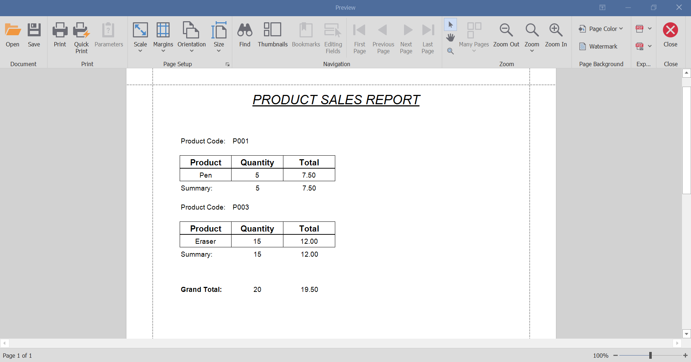

# Sale Reporting Tool

A Product Sales Reporting Tool for an internal
business system, allows user to select date range in order to query for sales report between start date and end date.

## Features

- DateTimePicker: Select date range (start date and end date)

- Generate button: to generate sales report according to selected date range

- Data: All data is stored in SQL Server database

## Technologies used

- C#

- .NET 8.0

- Window Forms

- ADO.NET

- SQL Server

- DevExpress XtraReport

## Development Tools

- Visual Studio 2022

- Git

- GitHub

## How to Get Started

- Go to the repository

```
 https://github.com/Meimei07/sales-reporting-tool.git
```

- Go to Release Sales Reporting Tool (on the right side, below About), and download the SalesReportingTool.zip

- Or click on this link: "https://github.com/Meimei07/sales-reporting-tool/releases/download/v1.0.0/SalesReportingTool.zip"

- Extract the zip file

Configure database

- Create a database table by running the 'script.sql' file in the SSMS

- Search for 'ProductSalesReportingTool.dll.config'

- Update the server name and database name to your own, and save

- Run the 'ProductSalesReportingTool.exe'

## Demo


